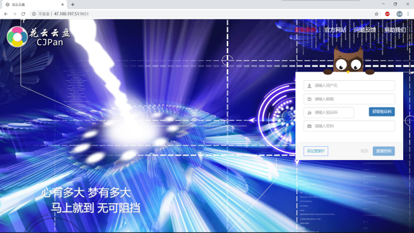
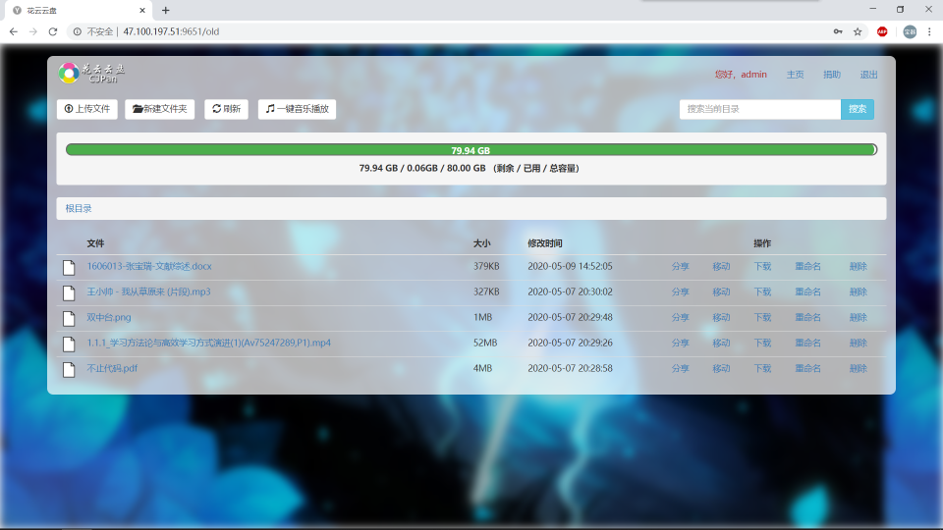
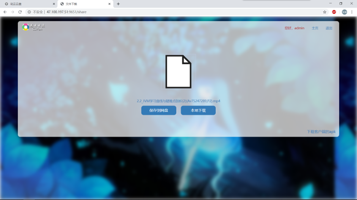
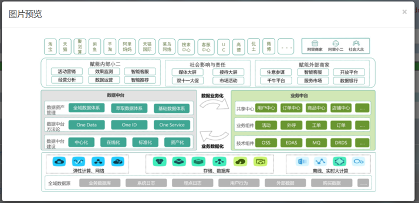
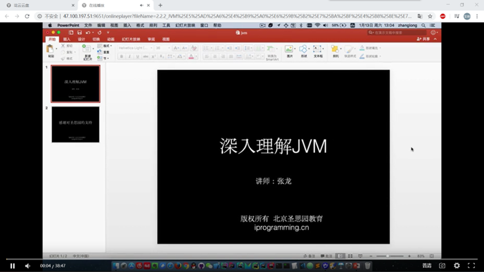

# budbreakCloud

## 前言

`budbreakCloud`项目致力于打造一个私人网盘，采用现阶段流行技术实现。

## 项目文档

- 文档地址：[https://github.com/baoqizhang/CloudPan](https://github.com/baoqizhang/CloudPan)

## 项目介绍
`budbreakCloud`项目是一个网盘系统,包括前台网盘系统及后台管理系统,基于Spring Boot + MyBatis-Plus+RabbitMQ+Shiro+JWT+Hadoop+Swagger+Redis实现。前台网盘系统包含当前用户存储文件信息、及部分用户信息、文件分享、文件下载、文件重命名、部分文件在线预览、音视频播放等功能。后台管理系统包含除管理员用户列表显示、用户密码重置、用户权限设置、用户逻辑删除、注册码生成等功能。

### 项目演示

#### 后台管理系统
项目演示地址： [http://47.100.197.51:9651/old](http://47.100.197.51:9651/old)  










### 组织结构

``` lua
budbreakpan
├── budbreakpan-common -- 工具类及通用代码
├── budbreakpan-dao -- 数据库操作代码
├── budbreakpan-entity -- 实体类
├── budbreakpan-manager -- manager层
├── budbreakpan-service -- 业务处理层
└── budbreakpan-controller -- controller层
```

### 技术选型

#### 后端技术

| 技术                 | 说明                | 官网                                                         |
| -------------------- | ------------------- | ------------------------------------------------------------ |
| SpringBoot           | 容器+MVC框架        | [https://spring.io/projects/spring-boot](https://spring.io/projects/spring-boot) |
| Shiro       | 认证和授权框架      | [http://shiro.apache.org/](http://shiro.apache.org/) |
| MyBatis-Plus              | ORM框架             | [https://mp.baomidou.com/l](https://mp.baomidou.com/l) |
| PageHelper           | MyBatis物理分页插件 | [http://git.oschina.net/free/Mybatis_PageHelper](http://git.oschina.net/free/Mybatis_PageHelper) |
| Swagger-UI           | 文档生产工具        | [https://github.com/swagger-api/swagger-ui](https://github.com/swagger-api/swagger-ui) |
| Hibernator-Validator | 验证框架            | [http://hibernate.org/validator/](http://hibernate.org/validator/) |
| RabbitMq             | 消息队列            | [https://www.rabbitmq.com/](https://www.rabbitmq.com/)       |
| Redis                | 分布式缓存          | [https://redis.io/](https://redis.io/)                       |
| Docker               | 应用容器引擎        | [https://www.docker.com/](https://www.docker.com/)           |
| Druid                | 数据库连接池        | [https://github.com/alibaba/druid](https://github.com/alibaba/druid) |
| JWT                  | JWT登录支持         | [https://github.com/jwtk/jjwt](https://github.com/jwtk/jjwt) |
| Lombok               | 简化对象封装工具    | [https://github.com/rzwitserloot/lombok](https://github.com/rzwitserloot/lombok) |

#### 前端技术

| 技术       | 说明                  | 官网                                                         |
| ---------- | --------------------- | ------------------------------------------------------------ |
| Vue        | 前端框架              | [https://vuejs.org/](https://vuejs.org/)                     |
| Vue-router | 路由框架              | [https://router.vuejs.org/](https://router.vuejs.org/)       |
| Vuex       | 全局状态管理框架      | [https://vuex.vuejs.org/](https://vuex.vuejs.org/)           |
| Element    | 前端UI框架            | [https://element.eleme.io/](https://element.eleme.io/)       |
| Axios      | 前端HTTP框架          | [https://github.com/axios/axios](https://github.com/axios/axios) |
| v-charts   | 基于Echarts的图表框架 | [https://v-charts.js.org/](https://v-charts.js.org/)         |
| Js-cookie  | cookie管理工具        | [https://github.com/js-cookie/js-cookie](https://github.com/js-cookie/js-cookie) |
| nprogress  | 进度条控件            | [https://github.com/rstacruz/nprogress](https://github.com/rstacruz/nprogress) |


## 环境搭建

### 开发工具

| 工具          | 说明                | 官网                                            |
| ------------- | ------------------- | ----------------------------------------------- |
| IDEA          | 开发IDE             | https://www.jetbrains.com/idea/download         |
| RedisDesktop  | redis客户端连接工具 | https://redisdesktop.com/download               |
| Robomongo     | mongo客户端连接工具 | https://robomongo.org/download                  |
| SwitchHosts   | 本地host管理        | https://oldj.github.io/SwitchHosts/             |
| X-shell       | Linux远程连接工具   | http://www.netsarang.com/download/software.html |
| Navicat       | 数据库连接工具      | http://www.formysql.com/xiazai.html             |
| PowerDesigner | 数据库设计工具      | http://powerdesigner.de/                        |
| Axure         | 原型设计工具        | https://www.axure.com/                          |
| MindMaster    | 思维导图设计工具    | http://www.edrawsoft.cn/mindmaster              |
| ScreenToGif   | gif录制工具         | https://www.screentogif.com/                    |
| ProcessOn     | 流程图绘制工具      | https://www.processon.com/                      |
| PicPick       | 图片处理工具        | https://picpick.app/zh/                         |
| Snipaste      | 屏幕截图工具        | https://www.snipaste.com/                       |

### 开发环境

| 工具          | 版本号 | 下载                                                         |
| ------------- | ------ | ------------------------------------------------------------ |
| JDK           | 1.8    | https://www.oracle.com/technetwork/java/javase/downloads/jdk8-downloads-2133151.html |
| Mysql         | 5.7    | https://www.mysql.com/                                       |
| Redis         | 3.2    | https://redis.io/download                                    |
| RabbitMq      | 3.7.14 | http://www.rabbitmq.com/download.html                        |
| Nginx         | 1.10   | http://nginx.org/en/download.html                            |


## 参考资料

- [Spring实战（第4版）](https://book.douban.com/subject/26767354/)
- [Spring Boot实战](https://book.douban.com/subject/26857423/)
- [Spring Cloud微服务实战](https://book.douban.com/subject/27025912/)
- [Spring Cloud与Docker微服务架构实战](https://book.douban.com/subject/27028228/)
- [Spring Data实战](https://book.douban.com/subject/25975186/)
- [MyBatis从入门到精通](https://book.douban.com/subject/27074809/)
- [深入浅出MySQL](https://book.douban.com/subject/25817684/)
- [循序渐进Linux（第2版）](https://book.douban.com/subject/26758194/)
- [Elasticsearch 权威指南](https://www.elastic.co/guide/cn/elasticsearch/guide/current/index.html)
- [Elasticsearch 技术解析与实战](https://book.douban.com/subject/26967826/)
- [MongoDB实战(第二版)](https://book.douban.com/subject/27061123/)
- [Kubernetes权威指南](https://book.douban.com/subject/26902153/)
- [Pro Git](https://git-scm.com/book/zh/v2)

## 联系
邮箱:965178162@qq.com
